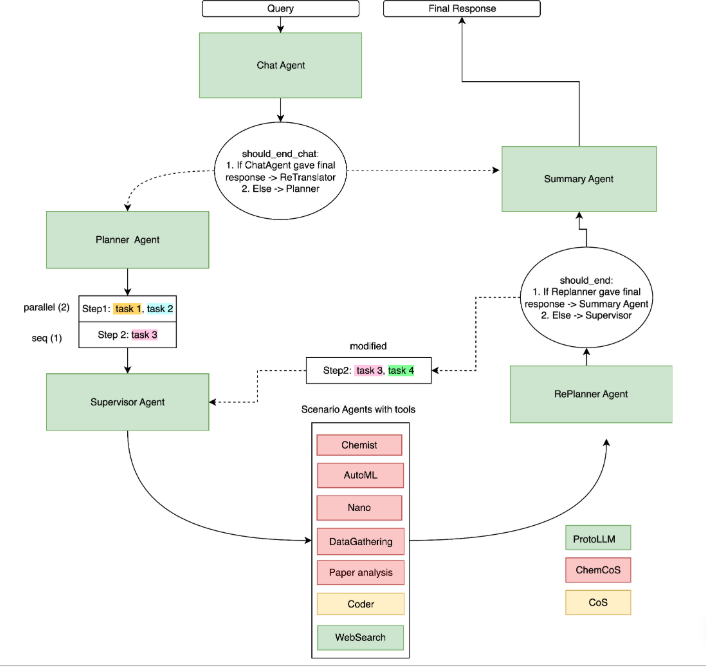

# CoScientist

## Overview

CoScientist is a research effort focused on accelerating scientific discovery in chemistry and materials science through an innovative, multi-agent AI system. Recognizing that traditional approaches struggle to keep pace with the growing complexity of scientific data and workflows, this system moves beyond single large language models to leverage a team of specialized agents. These agents automate tasks such as data preparation, machine learning model training, and molecular property prediction, ultimately freeing up scientists to focus on hypothesis generation and creative problem-solving. Developed at ITMO University, the project aims to demonstrate the effectiveness of AI-assisted techniques for tackling bottlenecks in chemical research, particularly those related to routine data handling and analysis.

---

## Table of Contents

- [Content](#content)
- [Algorithms](#algorithms)
- [Installation](#installation)
- [Getting Started](#getting-started)
- [Citation](#citation)

---
## Content

CoScientist is an agent-based system designed to accelerate chemical and materials science research by automating traditionally laborious tasks. It integrates large language models with specialized tools to support a comprehensive scientific workflow. Key components include specialized agents for data acquisition and preparation—utilizing databases like ChEMBL and BindingDB—machine learning model training and inference, and chemical property prediction. A user interface facilitates interaction, while an API enables programmatic access. The system supports both predictive and generative modeling, enhancing iterative scientific investigation by allowing researchers to focus on hypothesis exploration and refinement. A core principle is a multi-agent approach to avoid limitations of monolithic models and leverage specialized expertise.

---

## Algorithms

The project leverages a multi-agent system, combining Large Language Models (LLMs) with specialized tools to accelerate chemistry research. A core technique is the use of ReAct agents, which iteratively plan, act, and observe to complete complex tasks like data analysis and molecule generation. Code generation is automated using agents capable of writing and executing code, and machine learning agents perform tasks like property prediction. Furthermore, the system employs automated data retrieval from chemical databases (ChEMBL, BindingDB) and incorporates vector databases for efficient scientific literature analysis, facilitating knowledge discovery and research productivity.

---

## Installation

**Prerequisites:** requires Python >=3.11,<3.12

### Run ChemCoScientist locally:

1. Install dependencies
```commandline
poetry install
poetry run pip install --no-deps git+https://github.com/aimclub/ProtoLLM.git@main
```
2. Create a `config.env` file in the root of the project based on (example_config.env)[example_config.env]
3. Add a new query in (main_cli.py)[ChemCoScientist/main_cli.py], e.g.:
```inputs = {"input": "Generate an image of spherical nanoparticles."}```
4. Run (main_cli.py)[ChemCoScientist/main_cli.py]

### Run ChemCoScientist in Docker:

1. Create a `config.env` file in the root of the project based on (example_config.env)[example_config.env]
2. Adjust the path to the volume if necessary in docker-compose.yml
3. Run `cd docker`
4. Run `docker compose up`

## Getting Started with ChemCoScientist

To start interacting with CoScientist, you can begin by simply asking it what it can do:

```python
"What can you do?"
```

Here are a few more examples of how to use ChemCoScientist:

**Dataset preparation:**
```python
"Download data from ChemBL on the MEK1 protein with IC_50 calculations. Be sure to prepare them for training - remove junk data"
"Prepare data for training from the file ./data_dir_for_coder/ChEMBL_data.xlsx - delete all values ​​where docking_score > -6."
"Download data from BindingDB on MEK1 protein with Ki calculations. Remove junk data."
```

**AutoML/DL:**
```python
"Run training of the generative model on data from ./data_dir_for_coder/processed_MEK1_IC50_data.xlsx , specify the IC50 target, name the case MEK1."
"Check the status of the training for the MEK1 case"
"Start generating molecules for the MEK1 case."
"Predict the properties of COc1ccc(-c2cc3ncn(C)c(=O)c3c(NC3CC3)n2)cc1OC using the MEK1 ml model."
"Find out for which cases there are generative models ready for inference?"
```



---

## Citation

If you use this software, please cite it as below.

### APA format:

    ITMO-NSS-team (2025). CoScientist repository [Computer software]. https://github.com/ITMO-NSS-team/CoScientist

### BibTeX format:

    @misc{CoScientist,

        author = {ITMO-NSS-team},

        title = {CoScientist repository},

        year = {2025},

        publisher = {github.com},

        journal = {github.com repository},

        howpublished = {\url{https://github.com/ITMO-NSS-team/CoScientist.git}},

        url = {https://github.com/ITMO-NSS-team/CoScientist.git}

    }

---
